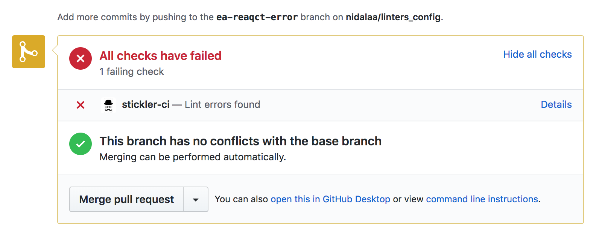
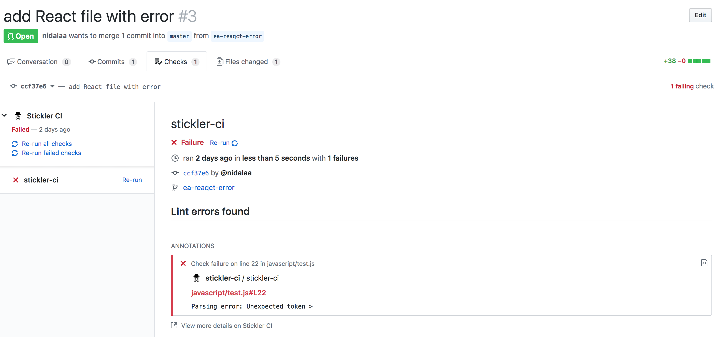

# linters-config

## How to use this repo? 🤔

Each directory listed below contains config files specific to one programming language and README file with detailed instructions:

- [html](./html_validator) (validator not linter)
- [css](./css)
- [ruby](./ruby)
- [ror](./ror)
- [javascript](./javascript)
- [react&redux](./react-redux)

Follow those instructions in order to set up linters or validators in your repo.

In order to get to know more about linters and Stickler read the recap below.

## Linters

A linter is a tool that analyzes your source code to flag programming errors, bugs, stylistic errors, and suspicious constructs(source: [Wikipedia](<https://en.wikipedia.org/wiki/Lint_(software)>)).

There are a few reasons for using linters:

1. Catching syntax errors is more efficient. There is no need to debug simple mistakes like typos - the linter does it for you.
2. The entire codebase looks like written by one person.
3. Programmers can focus on solving problems, instead of cleaning up the code.

---

You can find linters for most of the programming languages, e.g. Rubocop for Ruby or ESLint for JavaScript.

Also, there are many ways you can integrate a linter in your workflow:

- text editor plugin
- git hook
- Github app.

## Stickler

Stickler is an app, that can be integrated into any Github repo. It uses multiple linters that can be configured according to the programmer’s needs.

🐛 **What to do if Stickler does not work?** Check [Troubleshooting](./#troubleshooting) below.

With Stickler enabled you can see:

- Linting result in your PR
  
- `Checks` tab in your PR
  
- Comments under any problematic line of code
  

See more: https://stickler-ci.com/

## Troubleshooting

Depending on the configuration of your GitHub credentials, you may have an error like this when trying to create a new GitHub Actions workflow:

```
! [remote rejected] master -> master (refusing to allow an OAuth App to create or update workflow `.github/workflows/file.yml` without `workflow` scope)

```

The problem is that you may be using a credentials app like [Credential Manager in Windows](https://github.com/gitextensions/gitextensions/issues/4916#issuecomment-557509451) or OSX Keychain. In that case, you should [setup a personal access token](https://help.github.com/en/github/authenticating-to-github/creating-a-personal-access-token-for-the-command-line) and configure it in your credentials app. Make sure to check the `workflow` permissions whne you setup your personal access token.


If you had a different problem related to a specific tool, please check detailed instructions for each linter:

- [css](./css#troubleshooting)
- [ruby](./ruby#troubleshooting)
- [ror](./ror#troubleshooting)
- [javascript](./javascript#troubleshooting)
- [react&redux](./react-redux#troubleshooting)

## Validation

Do not make any changes in config files - they represent style guidelines that you share with your team - which is a group of all Microverse students.

TSEs will validate that you are using the same configuration files provided here. You can check if your linter configuration is correct using the [`check-linters-config`](scripts) script.

## Contributing

Everybody is welcome to suggest changes in linters config files.

In order to do it, fork this repository, create a new branch and open a Pull Request from your branch. A detailed description of this process: [A Step by Step Guide to Making Your First GitHub Contribution by Roshan Jossey](https://codeburst.io/a-step-by-step-guide-to-making-your-first-github-contribution-5302260a2940)
