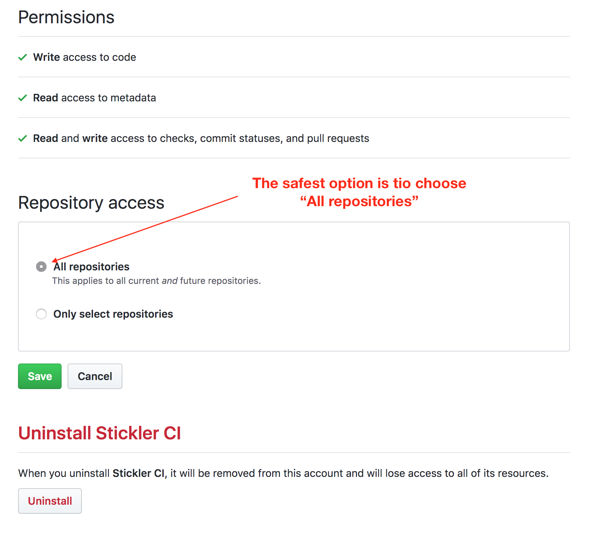

# Javascript

If you are not familiar with linters and Stickler, read [root level README](../README.md).

Please do the following **steps in this order**:

### Set-up Stickler (Github app) - it will show that your app is free from style errors
1. Install stickler-ci https://github.com/apps/stickler-ci
2. Enable stickler in your repo. You can do it [here](https://stickler-ci.com/).
3. In first commit of your feature branch add a copy of [.stickler.yml](./.stickler.yml).
   - **Remember** to use the file linked above
   - **Remember** that `.stickler.yml` file name starts with a dot.
4. **Do not make any changes in config files - they represent style guidelines that you share with your team - which is a group of all Microverse students.**
    - If you think that a change is necessary - open a [Pull Request in this repository](../README.md#contributing) and let your code reviewer know about it.
5. When you first open a pull request you should see Stickler's report at `Checks` tab.

### Set-up ESlint in your local env - it will help you to find style errors
1. Make sure you have `Nodejs` and `npm` installed locally on your computer by running `node -v` and `npm -v` on your terminal, you should see an output that looks like this: 

If you don't have Nodejs installed on your computer, here is a [great article on how to do it.](https://linuxize.com/post/how-to-install-node-js-on-ubuntu-18.04/) 

2. Run `npx eslint --init`.
3. Make sure you select the following options when prompted.

4. Copy the contents of [.eslintrc.json](./.eslintrc.json) to the newly generated `.eslintrc.json` overwritting the previous content, this will remove the globals ruleset, add a new envyroment and add some custom rules.
5. **Do not make any changes in config files - they represent style guidelines that you share with your tem - which is a group of all Microverse students.**
    - If you think that change is necessary - open a [Pull Request in this repository](../README.md#contributing) and let your code reviewer know about it.
5. Double check your `./src` folder for any extra unnecesary `.eslint` config files that might have been generated as this might cause an issue with stickler when you create your Pull Request later on.
6. Run `npx eslint .`.
7. Fix linter errors.
8. **IMPORTANT NOTE**: feel free to research [auto-correct options for ESlint](https://eslint.org/docs/user-guide/command-line-interface#fixing-problems) if you get a flood of errors but keep in mind that correcting style errors manually will help you to make a habit of writing a clean code!

## Troubleshooting

1. All config files are in my repo bu Stickler does not work.

   - Make sure that Stickler app has permission to access your repository. Find Stickler here https://github.com/settings/installations and check its configuration.

   

   - Try to add a new commit to your Pull Request. Stickler should detect changes in your repo and start checking your code.

2. `while scanning for the next token found character '\t' that cannot start any token` error.
   - Please make sure that you used spaces not tabs for indentation.
3. Check if someone else has had similar problem before [here](https://questions.microverse.org/c/linters-stickler).
   Please make sure that you used spaces not tabs for indentation.
4. Stickler does not work and nothing helps 💥 - run [eslint](https://eslint.org/) in your local env and correct all errors. **Remember to let your Code Reviewer know that you had problems with Stickler and you used linter in local env.**
